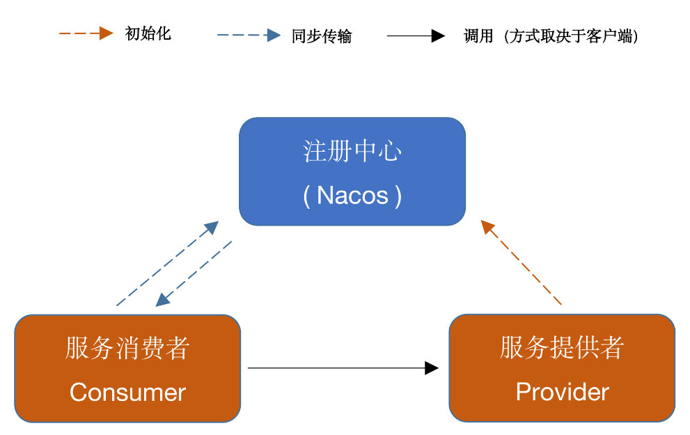

# QJAVA-RPC

My-RPC-Framework 是一款基于 Nacos 实现的 RPC 框架。网络传输实现了基于 Java 原生 Socket 与 Netty 版本，并且实现了多种序列化与负载均衡算法。

## 架构



消费者调用提供者的方式取决于消费者的客户端选择，如选用原生 Socket 则该步调用使用 BIO，如选用 Netty 方式则该步调用使用 NIO。如该调用有返回值，则提供者向消费者发送返回值的方式同理。

## 特性

- 实现了基于 Java 原生 Socket 传输与 Netty 传输两种网络传输方式
- 实现了四种序列化算法，Json 方式、Kryo 算法、Hessian 算法与 Google Protobuf 方式（默认采用 Kryo方式序列化）
- 实现了两种负载均衡算法：随机算法与轮转算法
- 使用 Nacos 作为注册中心，管理服务提供者信息
- 如消费端和提供者都采用 Netty 方式，会采用 Netty 的心跳机制，保证连接
- 接口抽象良好，模块耦合度低，网络传输、序列化器、负载均衡算法可配置
- 实现自定义的通信协议
- 服务提供侧自动注册服务

## 项目模块概览

- **api**	——	通用接口
- **common**	——	实体对象、工具类等公用类
- **core**	——	框架的核心实现
- **rpc-client**	——	测试用消费侧
- **rpc-server**	——	测试用提供侧

## 传输协议（MRF协议）

调用参数与返回值的传输采用了如下 MRF 协议（ My-RPC-Framework 首字母）以防止粘包：

```
+---------------+---------------+-----------------+-------------+
|  Magic Number |  Package Type | Serializer Type | Data Length |
|    4 bytes    |    4 bytes    |     4 bytes     |   4 bytes   |
+---------------+---------------+-----------------+-------------+
|                          Data Bytes                           |
|                   Length: ${Data Length}                      |
+---------------------------------------------------------------+
```

| 字段            | 解释                                                         |
| :-------------- | :----------------------------------------------------------- |
| Magic Number    | 魔数，表识一个 MRF 协议包，0xCAFEBABE                        |
| Package Type    | 包类型，标明这是一个调用请求还是调用响应                     |
| Serializer Type | 序列化器类型，标明这个包的数据的序列化方式                   |
| Data Length     | 数据字节的长度                                               |
| Data Bytes      | 传输的对象，通常是一个`RpcRequest`或`RpcClient`对象，取决于`Package Type`字段，对象的序列化方式取决于`Serializer Type`字段。 |

## 使用

### 定义调用接口

```java
package com.mumu.rpc.api;
//
//                       .::::.
//                     .::::::::.
//                    :::::::::::
//                 ..:::::::::::'
//              '::::::::::::'
//                .::::::::::
//           '::::::::::::::..
//                ..::::::::::::.
//              ``::::::::::::::::
//               ::::``:::::::::'        .:::.
//              ::::'   ':::::'       .::::::::.
//            .::::'      ::::     .:::::::'::::.
//           .:::'       :::::  .:::::::::' ':::::.
//          .::'        :::::.:::::::::'      ':::::.
//         .::'         ::::::::::::::'         ``::::.
//     ...:::           ::::::::::::'              ``::.
//    ```` ':.          ':::::::::'                  ::::..
//                       '.:::::'                    ':'````..
//
//
//
//                  年少太轻狂，误入码农行。
//                  白发森森立，两眼直茫茫。
//                  语言数十种，无一称擅长。
//                  三十而立时，无房单身郎。
//
//


/**
 * 测试用api的接口
 * @Auther: mumu
 * @Date: 2022-09-14 18:59
 * @Description: com.mumu.rpc.api
 * @version:1.0
 */
public interface HelloService {

    String hello(HelloObject object);

}
```

### 在服务提供侧实现该接口

```java

package com.mmumu.rpc.server;
//
//                       .::::.
//                     .::::::::.
//                    :::::::::::
//                 ..:::::::::::'
//              '::::::::::::'
//                .::::::::::
//           '::::::::::::::..
//                ..::::::::::::.
//              ``::::::::::::::::
//               ::::``:::::::::'        .:::.
//              ::::'   ':::::'       .::::::::.
//            .::::'      ::::     .:::::::'::::.
//           .:::'       :::::  .:::::::::' ':::::.
//          .::'        :::::.:::::::::'      ':::::.
//         .::'         ::::::::::::::'         ``::::.
//     ...:::           ::::::::::::'              ``::.
//    ```` ':.          ':::::::::'                  ::::..
//                       '.:::::'                    ':'````..
//
//
//
//                  年少太轻狂，误入码农行。
//                  白发森森立，两眼直茫茫。
//                  语言数十种，无一称擅长。
//                  三十而立时，无房单身郎。
//
//


import com.mumu.rpc.api.HelloObject;
import com.mumu.rpc.api.HelloService;
import com.mumu.rpc.core.annotation.Service;
import org.slf4j.Logger;
import org.slf4j.LoggerFactory;

/**
 * HelloServer服务实现
 * @Auther: mumu
 * @Date: 2022-09-14 19:06
 * @Description: com.mmumu.rpc.server.impl
 * @version:1.0
 */
@Service
public class HelloServiceImpl implements HelloService {

    private static final Logger logger = LoggerFactory.getLogger(HelloServiceImpl.class);

    @Override
    public String hello(HelloObject object) {
        logger.info("接收到消息：{}", object.getMessage());
        return "这是Impl1方法";
    }

}
```

### 编写服务提供者

```java
package com.mmumu.rpc.server;
//
//                       .::::.
//                     .::::::::.
//                    :::::::::::
//                 ..:::::::::::'
//              '::::::::::::'
//                .::::::::::
//           '::::::::::::::..
//                ..::::::::::::.
//              ``::::::::::::::::
//               ::::``:::::::::'        .:::.
//              ::::'   ':::::'       .::::::::.
//            .::::'      ::::     .:::::::'::::.
//           .:::'       :::::  .:::::::::' ':::::.
//          .::'        :::::.:::::::::'      ':::::.
//         .::'         ::::::::::::::'         ``::::.
//     ...:::           ::::::::::::'              ``::.
//    ```` ':.          ':::::::::'                  ::::..
//                       '.:::::'                    ':'````..
//
//
//
//                  年少太轻狂，误入码农行。
//                  白发森森立，两眼直茫茫。
//                  语言数十种，无一称擅长。
//                  三十而立时，无房单身郎。
//
//


import com.mumu.rpc.core.annotation.ServiceScan;
import com.mumu.rpc.core.serializer.CommonSerializer;
import com.mumu.rpc.core.transport.RpcServer;
import com.mumu.rpc.core.transport.netty.server.NettyServer;

/**
 * 测试用Netty服务提供者（服务端）
 * @Auther: mumu
 * @Date: 2022-10-21 12:19
 * @Description: com.mmumu.rpc.server
 * @version:1.0
 */
@ServiceScan
public class NettyTestServer {

    public static void main(String[] args) {
        RpcServer server = new NettyServer("127.0.0.1", 9999, CommonSerializer.PROTOBUF_SERIALIZER);
        server.start();
    }

}
```

这里选用 Netty 传输方式，并且指定序列化方式为 Google Protobuf 方式。

### 在服务消费侧远程调用

```java
package com.mumu.rpc.client;
//
//                       .::::.
//                     .::::::::.
//                    :::::::::::
//                 ..:::::::::::'
//              '::::::::::::'
//                .::::::::::
//           '::::::::::::::..
//                ..::::::::::::.
//              ``::::::::::::::::
//               ::::``:::::::::'        .:::.
//              ::::'   ':::::'       .::::::::.
//            .::::'      ::::     .:::::::'::::.
//           .:::'       :::::  .:::::::::' ':::::.
//          .::'        :::::.:::::::::'      ':::::.
//         .::'         ::::::::::::::'         ``::::.
//     ...:::           ::::::::::::'              ``::.
//    ```` ':.          ':::::::::'                  ::::..
//                       '.:::::'                    ':'````..
//
//
//
//                  年少太轻狂，误入码农行。
//                  白发森森立，两眼直茫茫。
//                  语言数十种，无一称擅长。
//                  三十而立时，无房单身郎。
//
//


import com.mumu.rpc.api.ByeService;
import com.mumu.rpc.api.HelloObject;
import com.mumu.rpc.api.HelloService;
import com.mumu.rpc.core.serializer.CommonSerializer;
import com.mumu.rpc.core.transport.RpcClient;
import com.mumu.rpc.core.transport.RpcClientProxy;
import com.mumu.rpc.core.transport.netty.client.NettyClient;


/**
 * 测试用Netty消费者
 * @Auther: mumu
 * @Date: 2022-10-21 12:08
 * @Description: com.mumu.rpc.client
 * @version:1.0
 */
public class NettyTestClient {
    public static void main(String[] args) {
        RpcClient client = new NettyClient(CommonSerializer.PROTOBUF_SERIALIZER);
        RpcClientProxy rpcClientProxy = new RpcClientProxy(client);
        HelloService helloService = rpcClientProxy.getProxy(HelloService.class);
        HelloObject object = new HelloObject(12, "This is a message");
        String res = helloService.hello(object);
        System.out.println(res);
        ByeService byeService = rpcClientProxy.getProxy(ByeService.class);
        System.out.println(byeService.bye("Netty"));

    }
}
```

这里客户端也选用了 Netty 的传输方式，序列化方式采用 Kryo 方式，负载均衡策略指定为轮转方式。

### 启动

在此之前请确保 Nacos 运行在本地 `8848` 端口。

首先启动服务提供者，再启动消费者，在消费侧会输出`Hello, ziyang`。

## TODO

- 使用接口方式自动注册服务
- 配置文件

## LICENSE

https://github.com/1211884772/QJAVA-RPC